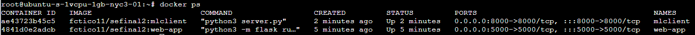
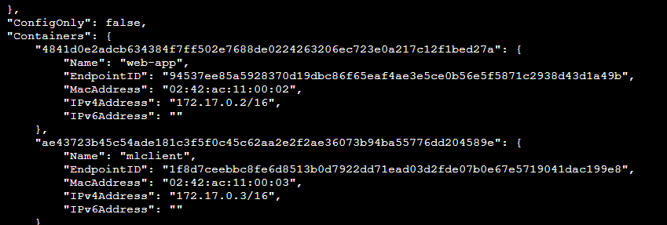

# Final Project

## Machine Learning Plant Recognition

Our web app allows users to capture or upload an image of a plant and we will identify the name of that plant using a machine learning model.

## Team Members

- Francisco Cunningham - [fctico11](https://github.com/fctico11)
- Ahmad Almesned - [ahmadhcs](https://github.com/ahmadhcs)
- Tanuj Sistla - [tanuj123-cyber](https://github.com/tanuj123-cyber)
- Abhi Vachani - [avachani](https://github.com/avachani)

## To run our project, locally use

```docker-compose up --build --force-recreate``` to build and run.
Then navigate to http://localhost:8000 to see the front end of the web app running and interact with our app.

### Unit Tests

To run unit tests, navigate to the root directory and use the command: ```pytest web-app/tests/test_app.py```
To check code coverage for the web-app, in the root directory run: ```pytest --cov=web-app web-app/tests```

## Link To Containers

[Both Containers](https://hub.docker.com/repository/docker/fctico11/sefinal2/general)

## Deployed Version

http://104.236.10.111:5000/ 

### Notes about deployed version

Our web-app successfully was deployed to a digital ocean droplet. However, we encountered issues when trying to post to the mlclient on the deployed version. The containers and images were succefully updated to the droplet 
, and they are even on the same network 
, but for some reason communication between them still did not work. We used docker compose to verify container names, and tried restarting docker compose services several times. Logs and diagnostics did not help either.

After troubleshooting and scouring the internet for solutions, we tried pinging the ip of the mlclient itself, the ip of the droplet and port, but ultimately determined the best solution was ```response = requests.post('http://mlclient:8000/process')```

The exact error we encountered was: ```{"error":"HTTPConnectionPool(host='mlclient', port=8000): Max retries exceeded with url: /process (Caused by NewConnectionError('<urllib3.connection.HTTPConnection object at 0x7191a4289490>: Failed to establish a new connection: [Errno -2] Name or service not known'))","msg":"Failed to ping mlclient"}```

Unfortunately we did not have time to resolve the issue so the deployed version only is able too handle the uploading of the images and saving to the database.
